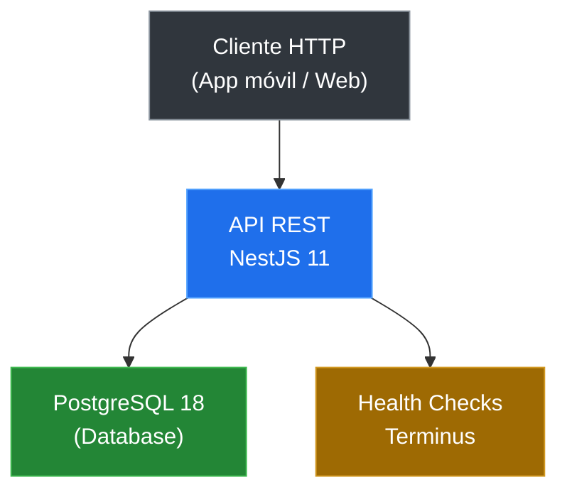

# 01 — ¿Qué es TURTLE-Backend?

## ¿Qué problema resuelve?

Un restaurante necesita controlar:

- **Inventario** de insumos (qué hay, dónde está, cuánto falta)
- **Proveedores** y sus catálogos de productos
- **Menú** (ítems, combos, recetas)
- **Pedidos** de clientes (mesa, tipo, estado, pago)

Sin un sistema, todo se lleva en papel, Excel o en la cabeza del cocinero. TURTLE-Backend centraliza esto en una API REST.

---

## ¿Qué hace?

| Funcionalidad | Estado |
|---|---|
| CRUD de almacenes (`storage_rooms`) | ✅ Listo |
| Health checks (API + BD) | ✅ Listo |
| CRUD de insumos | ⏳ Pendiente |
| Control de stock | ⏳ Pendiente |
| Gestión de proveedores | ⏳ Pendiente |
| Gestión de menú y pedidos | ⏳ Pendiente |

---

## ¿Cómo está construido?

- **API REST** con NestJS 11
- **Base de datos** PostgreSQL 18
- **ORM** Prisma 7 con `adapter-pg`
- **Contenedores** Docker con multi-stage build

---

## ¿Para quién es esta guía?

- **Desarrolladores** que se incorporan al proyecto
- **Tú del futuro** que olvidaste cómo funciona esto
- **Cualquier persona** que quiera entender el backend

---

[&larr; Volver al inicio](./README.md) | [Siguiente: Stack tecnológico &rarr;](./02-stack.md)
