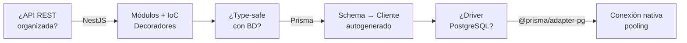

# 02 — Stack tecnológico

## Tecnologías principales

| Capa | Tecnología | Versión | ¿Para qué? |
|---|---|---|---|
| Runtime | Node.js | 24.15.0 | Ejecuta JavaScript en el servidor |
| Framework | NestJS | 11.x | Estructura la API con módulos, controladores y servicios |
| ORM | Prisma | 7.x | Conecta y consulta PostgreSQL con type-safety |
| Adapter | `@prisma/adapter-pg` | 7.x | Permite que Prisma use el driver `pg` nativo |
| Driver | `pg` | 8.x | Driver de PostgreSQL para Node.js |
| BD | PostgreSQL | 18 (Alpine) | Base de datos relacional |
| Idioma | TypeScript | 5.x | JavaScript con tipos estáticos |

---

## Dependencias clave

### Producción (17)

```json
"@nestjs/common"       // Decoradores, guards, pipes
"@nestjs/config"       // Variables de entorno
"@nestjs/core"         // IoC container, módulos
"@nestjs/platform-express" // Servidor HTTP Express
"@nestjs/terminus"     // Health checks
"@nestjs/axios"        // HTTP client para health checks
"@prisma/client"       // Cliente generado por Prisma
"@prisma/adapter-pg"   // Adaptador PostgreSQL
"pg"                   // Driver PostgreSQL
"reflect-metadata"     // Decoradores en tiempo de ejecución
"rxjs"                 // Programación reactiva
```

### Desarrollo (22)

```json
"@nestjs/cli"          // Generar módulos, controladores
"@nestjs/schematics"   // Plantillas de código
"@nestjs/testing"      // Test utilities
"typescript"           // Compilador TS
"ts-jest"              // Jest + TypeScript
"ts-node"              // Ejecutar TS directamente
"ts-loader"            // Webpack + TS (para nest build)
"prisma"               // CLI de Prisma
"eslint + prettier"    // Linter y formateador
"jest + supertest"     // Tests unitarios y E2E
```

---

## ¿Por qué estas tecnologías?



---

## Versiones de Node soportadas

El proyecto requiere **Node.js 24.15.0** exactamente (definido en `.nvmrc` y `package.json`).

```bash
nvm use        # Activar la versión correcta
node --version # → v24.15.0
```

---

[&larr; Anterior: Introducción](./01-introduccion.md) | [Siguiente: Arquitectura &rarr;](./03-arquitectura.md)
