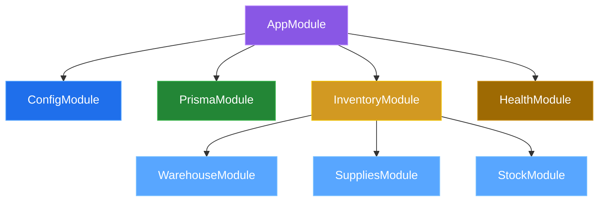
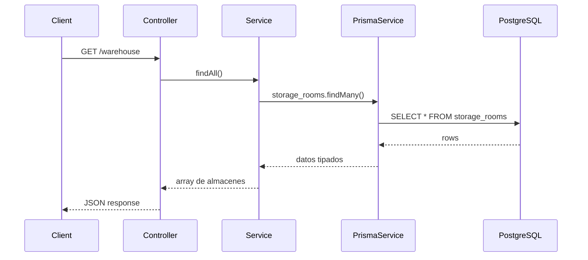

# 03 — Arquitectura de módulos

## Árbol de módulos



---

## AppModule (raíz)

```typescript
@Module({
  imports: [
    ConfigModule.forRoot({ isGlobal: true }),
    InventoryModule,
    PrismaModule,
    HealthModule,
  ],
  controllers: [AppController],
  providers: [AppService],
})
export class AppModule {}
```

---

## PrismaModule (global)

```typescript
@Global()
@Module({
  providers: [PrismaService],
  exports: [PrismaService],
})
```

- **Global**: cualquier módulo inyecta `PrismaService` sin importarlo
- Extiende `PrismaClient` usando `@prisma/adapter-pg`
- Lee `DATABASE_URL` desde `ConfigService`

## HealthModule

Expone `GET /health` con dos indicadores:

| Indicador | Qué verifica |
|---|---|
| `nestjs-docs` | Conectividad HTTP externa |
| `database` | Conexión a PostgreSQL |

---

## InventoryModule (agrupador)

Agrupa tres submódulos:

| Submódulo | Estado | Descripción |
|---|---|---|
| `WarehouseModule` | ✅ Funcional | CRUD de `storage_rooms` |
| `SuppliesModule` | ⏳ Scaffolded | Gestión de insumos |
| `StockModule` | ⏳ Scaffolded | Control de stock |

---

## Flujo de una petición



---

## Patrón por módulo

```
modulo/
├── modulo.module.ts      # @Module({ controllers, providers, exports })
├── modulo.controller.ts  # @Controller() con rutas HTTP
├── modulo.service.ts     # @Injectable() con lógica de negocio
├── dto/                  # Data Transfer Objects
├── entities/             # Modelos / entidades
└── *.spec.ts             # Tests
```

---

[&larr; Anterior: Stack](./02-stack.md) | [Siguiente: Base de datos &rarr;](./04-base-de-datos.md)
