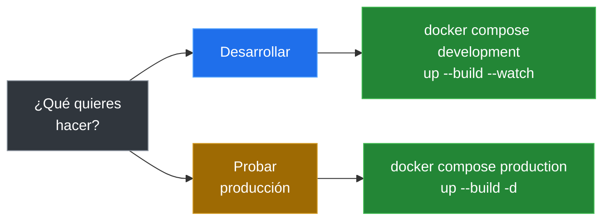

# 05 — Docker

## ¿Qué problema resuelve?

Cada desarrollador tiene un SO distinto. Docker empaqueta **la misma versión de Node, PostgreSQL y las dependencias** para que todos corran exactamente lo mismo.

---

## Estructura de archivos

```
├── Dockerfile                       # 4 etapas
├── docker-compose.yml               # Base: volúmenes, networks, healthcheck
├── docker-compose.development.yml   # Desarrollo: watch, hot-reload, pgAdmin
└── docker-compose.production.yml    # Producción: sin watch, restart always
```

---

## Elige tu opción



---

## Opción 1: Desarrollo

```bash
# Sin pgAdmin
docker compose \
  -f docker-compose.yml \
  -f docker-compose.development.yml \
  up --build --watch

# Con pgAdmin (perfil dbClient)
docker compose \
  -f docker-compose.yml \
  -f docker-compose.development.yml \
  --profile dbClient \
  up --build --watch
```

### Hot-reload

El flag `--watch` de Compose sincroniza cambios:

| Cambio en | Acción |
|---|---|
| `./src/` | Sync automático al contenedor |
| `package.json` | Rebuild de la imagen |

Dentro del contenedor, `tsx watch` reinicia el servidor sin EADDRINUSE.

---

## Opción 2: Producción

```bash
docker compose \
  -f docker-compose.yml \
  -f docker-compose.production.yml \
  up --build -d
```

### Diferencia con desarrollo

| Aspecto | Desarrollo | Producción |
|---|---|---|
| Imagen | Multi-stage `development` | Multi-stage `production` |
| Entrypoint | `npm run start:dev` | `node dist/main.js` |
| Watch | ✅ Sí | ❌ No |
| Restart | manual | `always` |
| pgAdmin | Opcional (perfil) | ❌ No |

---

## Servicios

| Servicio | Imagen | Puerto | Healthcheck |
|---|---|---|---|
| `turtle-backend` | Personalizada | `${PORT}` | `GET /health` c/15s |
| `postgres-db` | `postgres:18-alpine` | `${HOST_POSTGRES_PORT}` | `pg_isready` c/10s |
| `pgadmin` | `dpage/pgadmin4:9.14.0` | `${HOST_PGADMIN_PORT}` | `/misc/ping` c/10s |

---

## Dockerfile — 4 etapas

| Etapa | Propósito |
|---|---|
| `base` | `npm ci` + limpieza de caché |
| `development` | Copia fuente, entrypoint `tsx watch` |
| `builder` | `prisma generate` + `npm run build` + `npm prune --production` |
| `production` | Solo `dist/` + `node_modules` desde builder |

---

## Comandos útiles

```bash
# Logs del backend
docker compose logs -f turtle-backend

# Shell dentro del contenedor
docker compose exec turtle-backend sh

# Estado de salud
docker ps --filter name=turtle-backend

# Bajar todo + limpiar volúmenes
docker compose -f docker-compose.yml \
  -f docker-compose.development.yml \
  down -v
```

---

[&larr; Anterior: Base de datos](./04-base-de-datos.md) | [Siguiente: Desarrollo local &rarr;](./06-desarrollo.md)
