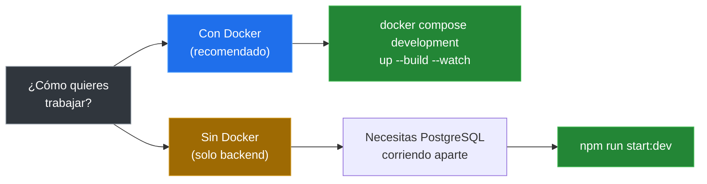

# 06 — Desarrollo local

## Setup inicial

```bash
nvm use                  # Node 24.15.0
npm install              # Instalar dependencias
npx prisma generate      # Generar cliente Prisma
```

---

## Elige tu opción



---

## Comandos del proyecto

| Comando | Qué hace |
|---|---|
| `npm run start:dev` | Hot-reload con `tsx watch` |
| `npm run build` | Compila a `dist/` |
| `npm run start:prod` | Corre la versión compilada |
| `npm run lint` | ESLint con autocorrección |
| `npm run format` | Prettier |
| `npm run test` | Tests unitarios (Jest) |
| `npm run test:cov` | Tests con cobertura |
| `npm run test:e2e` | Tests end-to-end |

---

## Flujo diario con Docker

```bash
# 1. Levantar servicios
docker compose -f docker-compose.yml \
  -f docker-compose.development.yml \
  up --build --watch

# 2. Editar código en ./src/
#    → Docker sync copia cambios al contenedor
#    → tsx watch reinicia el servidor

# 3. Verificar
curl http://localhost:3000/
curl http://localhost:3000/health

# 4. Tests dentro del contenedor
docker compose exec turtle-backend npm run test
```

---

## Instalar dependencias nuevas

```bash
npm install algun-paquete
# Docker detecta el cambio en package.json
# → rebuild automático
```

---

## Cambios en la base de datos

```bash
# 1. Editar SQL
vim database/scripts/schema/schema.sql

# 2. Aplicar a PostgreSQL (psql o pgAdmin)

# 3. Sincronizar Prisma
npx prisma db pull
npx prisma generate

# 4. Commitear todo
git add -A
git commit -m "feat(db): agregar columna X a tabla Y"
```

---

## Tests

```bash
npm run test        # Unitarios
npm run test:cov    # Con cobertura
npm run test:e2e    # End-to-end

# En Docker:
docker compose exec turtle-backend npm run test
```

---

[&larr; Anterior: Docker](./05-docker.md) | [Siguiente: API &rarr;](./07-api.md)
