# TURTLE-Backend

     

Backend del sistema de gestión para restaurante **TURTLE**. API REST construida con NestJS 11, Prisma 7 y PostgreSQL 18.

---

## Cómo usar esta guía

Cada documento explica un aspecto concreto del proyecto. Puedes seguirlos en orden o saltar al que te interese.

```mermaid
flowchart LR
    A["01 Introducción"] --> B["02 Stack"]
    B --> C["03 Arquitectura"]
    C --> D["04 Base de Datos"]
    D --> E["05 Docker"]
    E --> F["06 Desarrollo"]
    F --> G["07 API"]
    G --> H["08 Convenciones"]

    style A fill:#1f6feb,stroke:#58a6ff,color:#fff
    style B fill:#1f6feb,stroke:#58a6ff,color:#fff
    style C fill:#1f6feb,stroke:#58a6ff,color:#fff
    style D fill:#1f6feb,stroke:#58a6ff,color:#fff
    style E fill:#1f6feb,stroke:#58a6ff,color:#fff
    style F fill:#1f6feb,stroke:#58a6ff,color:#fff
    style G fill:#1f6feb,stroke:#58a6ff,color:#fff
    style H fill:#238636,stroke:#3fb950,color:#fff
```



---

## Ruta de aprendizaje

| # | Tema | Ir |
|---|------|----|
| 01 | ¿Qué es TURTLE-Backend? | [Abrir](./01-introduccion.md) |
| 02 | Stack tecnológico | [Abrir](./02-stack.md) |
| 03 | Arquitectura de módulos | [Abrir](./03-arquitectura.md) |
| 04 | Base de datos | [Abrir](./04-base-de-datos.md) |
| 05 | Docker | [Abrir](./05-docker.md) |
| 06 | Desarrollo local | [Abrir](./06-desarrollo.md) |
| 07 | API endpoints | [Abrir](./07-api.md) |
| 08 | Convenciones y troubleshooting | [Abrir](./08-convenciones.md) |

---

## De un vistazo

```
src/
├── main.ts                    # Entry point
├── app.module.ts              # Módulo raíz
├── app.controller.ts          # GET /
├── app.service.ts             # Servicio raíz
├── prisma/                    # Conexión a BD (global)
├── health/                    # Health checks
└── inventory/                 # Módulo de inventario
    ├── warehouse/             # Almacenes (CRUD funcional)
    ├── supplies/              # Insumos (scaffolded)
    └── stock/                 # Stock (scaffolded)
```

---

[Siguiente: Introducción &rarr;](./01-introduccion.md)
