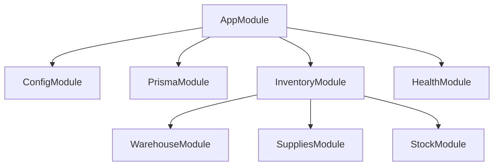

# Arquitectura

## Módulos

### AppModule (raíz)



| Módulo | Global | Descripción |
|---|---|---|
| `ConfigModule` | ✅ | Variables de entorno (`@nestjs/config`) |
| `PrismaModule` | ✅ | Conexión a PostgreSQL vía Prisma |
| `InventoryModule` | ❌ | Agrupador de submódulos de inventario |
| `HealthModule` | ❌ | Health checks con Terminus |

### PrismaModule

```typescript
@Global()
@Module({
  providers: [PrismaService],
  exports: [PrismaService],
})
```

- **Global**: cualquier módulo puede inyectar `PrismaService` sin importarlo
- Usa `@prisma/adapter-pg` con el `connectionString` desde `ConfigService`
- `PrismaService` extiende `PrismaClient`

### InventoryModule

Agrupa tres submódulos:

| Submódulo | Estado | Descripción |
|---|---|---|
| `WarehouseModule` | ✅ Funcional | CRUD de almacenes (tabla `storage_rooms`) |
| `SuppliesModule` | ⏳ Scaffolded | Gestión de insumos |
| `StockModule` | ⏳ Scaffolded | Control de stock |

## Patrón por módulo

Cada módulo funcional sigue la estructura:

```
modulo/
├── modulo.module.ts      # @Module({ controllers, providers, exports })
├── modulo.controller.ts  # @Controller() con rutas HTTP
├── modulo.service.ts     # @Injectable() con lógica de negocio
├── dto/                  # Data Transfer Objects
├── entities/             # Entidades / modelos
└── *.spec.ts             # Tests unitarios
```

## Flujo de datos

```
HTTP Request
  → Controller (valida DTOs, asigna códigos HTTP)
    → Service (lógica de negocio, orquesta queries)
      → PrismaService (consulta PostgreSQL)
        → Database (PostgreSQL 18)
```

## Health Module

Usa `@nestjs/terminus` para exponer `GET /health` con dos indicadores:

1. **HTTP ping** a `https://docs.nestjs.com` (verifica conectividad externa)
2. **Prisma ping** a PostgreSQL (verifica conectividad a DB)

Respuesta de ejemplo:
```json
{
  "status": "ok",
  "info": {
    "nestjs-docs": { "status": "up" },
    "database": { "status": "up" }
  }
}
```
